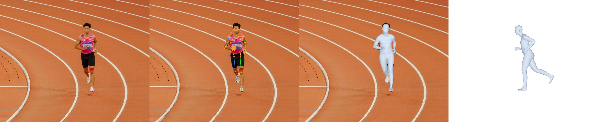

# SAM 3D Body - 人体3D重建与动作分析工具

基于 Meta SAM 3D Body 的完整人体3D重建解决方案，从单张图片或视频生成高精度3D人体模型，通过交互式网页查看器实现360度动作分析。

## 效果展示

### 静态场景分析

*从单张照片重建3D人体模型 - 展示原图、检测框、3D网格和侧视图*

### 运动姿态捕捉

*跑步动作捕捉与3D重建 - 精确捕捉运动中的身体姿态*

## 核心特性

### 🎯 重建能力
- **单图重建** - 从一张照片生成完整的3D人体网格模型
- **视频序列处理** - 逐帧提取动作，支持跳帧加速
- **多人同时检测** - 自动识别图像中的所有人物
- **全身精细建模** - 包含身体、手部、脚部细节（18,439顶点，36,874面片，70个3D关键点）

### 🎮 交互式3D查看器
- **360度自由视角** - 鼠标拖拽任意角度观察动作细节
- **预设视角切换** - 一键切换正面/背面/左侧/右侧视角
- **多种显示模式** - 实体网格、线框、骨架可视化
- **视角锁定功能** - 保持相同观察角度对比不同帧

### 📹 视频播放控制
- **精确逐帧浏览** - 方向键控制每一帧，Shift+方向键跳跃5帧
- **变速播放** - 0.25x ~ 4x 灵活调速
- **进度标记系统** - 标记关键动作帧，快速回顾
- **帧号精准跳转** - 直接定位到任意帧
- **完整快捷键支持** - 空格播放/暂停，键盘高效操作

### 🌐 Web应用集成
- **一键启动 Demo** - 拖拽上传，实时进度显示
- **HTTPS远程访问** - 支持手机/局域网上传，自动SSL证书生成
- **多格式支持** - 图片(JPG/PNG)、视频(MP4/AVI/MOV/MKV/WEBM)
- **OBJ格式导出** - 可导入Blender、Maya等专业3D软件

## 应用场景

- **舞蹈教学** - 多角度学习舞蹈动作，慢速逐帧分析细节
- **体育训练** - 姿势纠正，动作标准化分析
- **健身指导** - 观察动作规范性，避免运动损伤
- **动画制作** - 人体动作参考，姿态研究
- **医疗康复** - 运动功能评估，康复进度跟踪
- **虚拟试衣** - 3D人体模型生成

## 快速开始

### 一键启动 Web Demo（推荐）

```bash
python demo.py
```

浏览器自动打开，操作流程：
1. 拖拽或点击上传图片/视频
2. 查看实时处理进度
3. 自动跳转到3D查看器
4. 使用鼠标和键盘交互式查看

### 命令行快速处理

**处理图片：**
```bash
python process_image.py --image your_image.jpg
python viewer.py --mhr output/your_image.mhr.json
```

**处理视频：**
```bash
python process_video.py --video your_video.mp4 --frame_skip 2
python viewer.py --mhr_folder output/your_video/
```

## 安装配置

### 环境要求
- Python 3.11
- CUDA 12.1（推荐使用GPU，8GB+ VRAM）
- 操作系统：Linux / macOS / Windows

### 步骤 1: 创建环境

```bash
conda create -n 3d python=3.11 -y
conda activate 3d
```

### 步骤 2: 安装依赖

```bash
# 安装 PyTorch (CUDA 12.1)
pip install torch torchvision torchaudio --index-url https://download.pytorch.org/whl/cu121

# 安装核心依赖
pip install pytorch-lightning pyrender opencv-python yacs scikit-image einops timm \
    dill pandas rich hydra-core hydra-submitit-launcher hydra-colorlog pyrootutils \
    webdataset chump networkx==3.2.1 roma joblib seaborn wandb appdirs appnope \
    ffmpeg cython jsonlines pytest xtcocotools loguru optree fvcore black \
    pycocotools tensorboard huggingface_hub

# 安装 Detectron2（人体检测）
pip install 'git+https://github.com/facebookresearch/detectron2.git@a1ce2f9' \
    --no-build-isolation --no-deps

# 安装 MoGe（FOV估计）
pip install git+https://github.com/microsoft/MoGe.git
```

### 步骤 3: 下载模型

**注意：** 需要先申请 HuggingFace 访问权限

访问 [facebook/sam-3d-body-dinov3](https://huggingface.co/facebook/sam-3d-body-dinov3) 申请访问

```bash
# 登录 HuggingFace
huggingface-cli login

# 下载 SAM 3D Body 模型 (~2.7GB)
huggingface-cli download facebook/sam-3d-body-dinov3 \
    --local-dir checkpoints/sam-3d-body-dinov3

# 下载 MoGe 模型 (~1.3GB)
huggingface-cli download Ruicheng/moge-2-vitl-normal \
    --local-dir checkpoints/moge-2-vitl-normal
```

## 使用指南

### 方式一：Web Demo（最简单）

```bash
# 启动服务（默认端口 8080）
python demo.py

# 自定义配置
python demo.py --port 8080 --output ./output --host 0.0.0.0
```

**功能说明：**
- 自动打开浏览器
- 拖拽上传文件
- 实时处理进度
- 完成后自动跳转3D查看器

### 方式二：HTTPS 远程上传

适用于需要从手机或局域网设备上传文件的场景。

```bash
# 自动生成SSL证书（推荐）
python test_upload.py --auto-cert

# 自定义端口
python test_upload.py --port 8080 --auto-cert

# 使用自定义证书
python test_upload.py --ssl --cert my_cert.pem --key my_key.pem
```

**访问方式：**
1. 浏览器访问 `https://your_ip:8080`
2. 首次访问需信任自签名证书（点击"高级" → "继续访问"）
3. 上传文件并开始处理

**注意：** 首次使用 `--auto-cert` 需要安装 `pip install cryptography`

### 方式三：命令行批处理

#### 单张图片处理

```bash
python process_image.py --image your_image.jpg [选项]
```

**常用参数：**
| 参数 | 默认值 | 说明 |
|------|--------|------|
| `--output_folder` | `./output` | 输出目录 |
| `--bbox_thresh` | `0.8` | 人体检测阈值（0-1，越低检测越多人） |
| `--export_obj` | `False` | 导出OBJ格式（用于Blender等软件） |
| `--save_vis` | `True` | 保存2D可视化结果 |

**示例：**
```bash
# 检测所有人物并导出OBJ
python process_image.py --image group.jpg --bbox_thresh 0.6 --export_obj

# 查看结果
python viewer.py --mhr output/group.mhr.json
```

#### 视频处理

```bash
python process_video.py --video your_video.mp4 [选项]
```

**常用参数：**
| 参数 | 默认值 | 说明 |
|------|--------|------|
| `--frame_skip` | `0` | 跳帧数（0=不跳，2=每3帧取1帧） |
| `--start_frame` | `0` | 起始帧号 |
| `--end_frame` | `-1` | 结束帧号（-1=处理到结尾） |
| `--bbox_thresh` | `0.8` | 人体检测阈值 |
| `--save_vis` | `False` | 保存每帧可视化（占用大量空间） |

**处理时间建议：**
- **短视频（<30秒）** - `--frame_skip 0` 完整处理
- **中等视频（1-3分钟）** - `--frame_skip 2` 每3帧取1帧
- **长视频（>3分钟）** - `--frame_skip 4` 或指定帧范围

**示例：**
```bash
# 处理30秒-1分钟片段
python process_video.py --video dance.mp4 --start_frame 900 --end_frame 1800

# 快速预览（跳帧处理）
python process_video.py --video action.mp4 --frame_skip 5

# 查看结果
python viewer.py --mhr_folder output/dance/
```

## 3D查看器操作

### 🤚 手势识别控制（主要交互方式）

3D查看器支持基于 **MediaPipe** 的实时手势识别，让你无需接触设备即可操控3D模型。只需将手伸向摄像头，系统会自动识别手势并执行相应操作。

#### 单手手势控制

| 手势 | 功能 | 使用场景 |
|------|------|----------|
| 👍 **大拇指向上** | 下一帧/下一个模型 | 快速浏览动作序列 |
| 🤙 **小指向上** | 上一帧/上一个模型 | 回退查看细节 |
| 👈 **食指指向左侧** | 快退5帧 | 跳过重复动作 |
| 👉 **食指指向右侧** | 快进5帧 | 跳过重复动作 |
| ✌️ **V字手势** | 切换显示模式 | 在网格/线框/骨架间切换 |

#### 双手手势控制

| 手势 | 功能 | 使用场景 |
|------|------|----------|
| 👊👊 **双手握拳** | 重置视角 | 快速恢复默认观察角度 |
| 🖐️🖐️ **双手张开** | 播放/暂停视频 | 控制视频播放状态 |

#### 手势识别使用技巧

1. **首次使用** - 浏览器会请求摄像头权限，请允许访问
2. **手势稳定性** - 保持手势1秒以确保准确识别（系统需要3帧一致性确认）
3. **最佳距离** - 距离摄像头 30-80cm，确保手部完整出现在画面中
4. **光线条件** - 在明亮环境下识别效果更好
5. **手势间隔** - 每个手势执行后有 300-500ms 冷却时间，避免误触发
6. **视觉反馈** - 成功识别时界面会有明显的视觉提示

#### MediaPipe 自动加载

系统会自动从 CDN 加载 MediaPipe 库，无需手动配置。如果网络受限，可以：
- 使用备用 CDN（jsDelivr、unpkg）
- 本地部署 MediaPipe 文件

### 传统操作方式（辅助）

**鼠标控制：** 左键拖动旋转、滚轮缩放、右键平移
**键盘快捷键：** 空格播放/暂停、方向键逐帧控制、Shift+方向键跳5帧、+/- 缩放、Q/E 旋转、F/B 切换正面/背面视角
**界面按钮：** 预设视角切换、显示模式选择、播放控制、进度标记、视角锁定等

## 实用技巧

### 🕺 学习舞蹈动作

1. 处理舞蹈视频
   ```bash
   python demo.py
   # 上传视频，等待处理完成
   ```

2. 在查看器中操作
   - 点击"锁定视角"按钮
   - 切换到"背面视角"
   - 使用逐帧播放（←/→键）
   - 按M键标记关键动作帧

3. 反复学习
   - 点击进度标记快速回到关键帧
   - 调整播放速度（0.25x慢速观察）
   - 旋转视角观察细节

### ⚽ 分析运动姿势

1. 处理动作图片
   ```bash
   python process_image.py --image pose.jpg
   python viewer.py --mhr output/pose.mhr.json
   ```

2. 多角度分析
   - 使用预设视角按钮快速切换
   - 开启骨架显示查看关节位置
   - 使用缩放功能观察细节
   - 左键拖动自由旋转到任意角度

### 📊 对比多个姿势

1. 批量处理到同一目录
   ```bash
   python process_image.py --image pose1.jpg
   python process_image.py --image pose2.jpg
   python process_image.py --image pose3.jpg
   ```

2. 文件夹查看模式
   ```bash
   python viewer.py --mhr_folder output/
   ```

3. 锁定视角对比
   - 点击"锁定视角"
   - 在文件列表中切换不同姿势
   - 保持相同角度对比细节差异

### 🎬 制作动画参考

1. 导出OBJ文件
   ```bash
   python process_image.py --image ref.jpg --export_obj
   ```

2. 导入3D软件
   - 输出文件：`output/ref_person0.obj`
   - 可导入Blender、Maya、3ds Max等
   - 包含完整顶点和面片信息

## 输出文件格式

### 单图输出结构
```
output/
├── image_name.mhr.json       # 3D网格数据（JSON格式）
├── image_name_vis.jpg        # 2D可视化结果
└── image_name_person0.obj    # OBJ文件（可选，用--export_obj生成）
```

### 视频输出结构
```
output/video_name/
├── video_info.json           # 视频元信息（fps、分辨率、总帧数）
├── faces.json                # 共享面片索引数据（所有帧共用）
├── frame_000000.mhr.json     # 第1帧数据
├── frame_000001.mhr.json     # 第2帧数据
├── frame_000002.mhr.json     # 第3帧数据
└── ...
```

### MHR JSON 格式说明

MHR（Momentum Human Rig）是本项目使用的3D人体表示格式：

```json
{
  "version": "1.0",
  "image_path": "原始图片路径",
  "image_size": [宽度, 高度],
  "num_people": 检测到的人数,
  "faces": [[v0, v1, v2], ...],  // 36,874个三角面片索引
  "people": [
    {
      "id": 人物ID,
      "bbox": [x, y, w, h],
      "focal_length": 焦距,
      "camera": {
        "translation": [tx, ty, tz]
      },
      "mesh": {
        "vertices": [[x,y,z], ...],      // 18,439个3D顶点坐标
        "keypoints_3d": [[x,y,z], ...],  // 70个3D关键点
        "keypoints_2d": [[x,y,conf], ...] // 70个2D投影点
      },
      "params": {
        "global_rot": [...],    // 全局旋转参数
        "body_pose": [...],     // 身体姿态
        "shape": [...],         // 形状参数
        "scale": [...],         // 缩放
        "hand": [...],          // 手部姿态
        "expression": [...]     // 表情参数
      }
    }
  ]
}
```

**关键点布局（70个点）：**
- 17个身体关键点（COCO格式）
- 40个手部关键点（每只手20个）
- 6个脚部关键点
- 7个额外关键点（颈部、肘部、肩峰等）

## 技术架构

### 核心模型

**SAM 3D Body** - Meta AI
- 840M参数的单图3D人体重建模型
- 基于DINOv2-H+ Vision Transformer架构
- 输入分辨率：512×512
- 输出：MHR格式（18,439顶点，36,874面片）

**MHR (Momentum Human Rig)**
- 参数化人体网格表示
- 比SMPL更精细的手部和脚部建模
- 支持身体姿态、形状、表情参数化控制

### 辅助模型

- **ViTDet** - 基于Vision Transformer的人体检测器（来自Detectron2）
- **SAM2** - Segment Anything Model 2用于人体分割
- **MoGe2** - Microsoft单目几何估计器，用于FOV（视场角）估计

### 前端技术

- **Three.js** - WebGL 3D渲染引擎
- **OrbitControls** - 交互式相机控制
- HTML5 + CSS3 + JavaScript

### 深度学习框架

- PyTorch（CUDA 12.1）
- PyTorch Lightning
- Detectron2
- Hugging Face Hub

## 项目结构

```
sam-3d-body/
├── demo.py                      # 🌟 Web Demo应用（推荐入口）
├── test_upload.py               # 📱 HTTPS远程上传服务
├── process_image.py             # 🖼️  单图处理脚本
├── process_video.py             # 🎬 视频处理脚本
├── viewer.py                    # 👁️  3D网页查看器
│
├── sam_3d_body/                 # 核心Python包
│   ├── __init__.py              # API导出接口
│   ├── build_models.py          # 模型加载函数
│   ├── sam_3d_body_estimator.py # 推理估计器（主要API）
│   ├── models/                  # 模型架构
│   │   ├── meta_arch/           # SAM3DBody主模型
│   │   ├── backbones/           # DINOv2骨干网络
│   │   ├── decoders/            # Transformer解码器
│   │   ├── heads/               # MHR头、相机头
│   │   └── modules/             # 基础模块
│   ├── data/                    # 数据处理与变换
│   ├── visualization/           # 可视化工具
│   ├── metadata/                # MHR70关键点定义
│   └── utils/                   # 工具函数
│
├── tools/                       # 辅助工具
│   ├── mhr_io.py               # MHR文件读写工具
│   ├── build_detector.py       # 人体检测器构建
│   ├── build_sam.py            # SAM2分割器构建
│   ├── build_fov_estimator.py  # FOV估计器构建
│   └── vis_utils.py            # 2D可视化工具
│
├── checkpoints/                 # 模型文件目录
│   ├── sam-3d-body-dinov3/     # SAM 3D Body模型 (~2.7GB)
│   │   ├── model.ckpt          # 840M参数模型权重
│   │   ├── model_config.yaml   # 模型配置
│   │   └── assets/mhr_model.pt # MHR人体模型资源
│   ├── moge-2-vitl-normal/     # MoGe FOV估计模型 (~1.3GB)
│   └── vitdet/                 # ViTDet人体检测模型
│
├── output/                      # 处理结果输出目录
├── test_uploads/                # 远程上传文件保存目录
├── notebook/                    # Jupyter示例
│   └── demo_human.ipynb        # 快速入门示例
└── assets/                      # 项目资源文件
```

## 性能与硬件要求

### 推荐配置
- **GPU**: NVIDIA GPU，8GB+ VRAM（推荐RTX 3060或更高）
- **CPU**: 支持CPU模式，但速度较慢
- **内存**: 16GB+ RAM
- **存储**: 至少10GB可用空间（模型4GB + 输出文件）

### 处理速度参考
- **GPU模式**: ~2-5秒/帧（取决于GPU性能）
- **CPU模式**: ~30-60秒/帧
- **视频处理**: 30秒视频（900帧）跳帧处理约5-10分钟（GPU）

### 优化建议
- 使用 `--frame_skip` 参数跳帧处理长视频
- 指定 `--start_frame` 和 `--end_frame` 只处理关键片段
- 批量处理时关闭可视化 `--save_vis False` 节省空间
- 使用半精度推理（默认启用）加速处理

## 常见问题

### 模型下载问题

**Q: 无法访问HuggingFace？**

A: 可以使用镜像站点或通过代理访问。设置环境变量：
```bash
export HF_ENDPOINT=https://hf-mirror.com
```

**Q: 下载速度慢？**

A: 使用 `--resume` 参数支持断点续传：
```bash
huggingface-cli download facebook/sam-3d-body-dinov3 \
    --local-dir checkpoints/sam-3d-body-dinov3 --resume-download
```

### 运行错误

**Q: CUDA out of memory 错误？**

A: GPU显存不足，尝试：
- 降低输入图像分辨率
- 使用CPU模式（去掉CUDA安装）
- 处理视频时增大 `--frame_skip` 值

**Q: 检测不到人物？**

A: 调整检测阈值：
```bash
python process_image.py --image your.jpg --bbox_thresh 0.5
```

**Q: 处理速度慢？**

A: 确保使用GPU模式，检查：
```python
import torch
print(torch.cuda.is_available())  # 应该返回True
```

### Web应用问题

**Q: 浏览器没有自动打开？**

A: 手动访问 `http://localhost:8080`

**Q: 远程访问被拒绝？**

A: 确保使用 `--host 0.0.0.0`：
```bash
python demo.py --host 0.0.0.0
```

**Q: HTTPS证书警告？**

A: 自签名证书是安全的，点击"高级" → "继续访问"即可。

## API 使用示例

### Python API 调用

```python
from sam_3d_body import load_sam_3d_body, SAM3DBodyEstimator
from tools.build_detector import build_human_detector
from tools.build_sam import build_human_segmentor
from tools.build_fov_estimator import build_fov_estimator
import cv2

# 加载模型
model, cfg = load_sam_3d_body("checkpoints/sam-3d-body-dinov3/model.ckpt")

# 初始化辅助模块
detector = build_human_detector()
segmentor = build_human_segmentor()
fov_estimator = build_fov_estimator()

# 创建估计器
estimator = SAM3DBodyEstimator(
    sam_3d_body_model=model,
    model_cfg=cfg,
    human_detector=detector,
    human_segmentor=segmentor,
    fov_estimator=fov_estimator
)

# 处理图片
img = cv2.imread("image.jpg")
outputs = estimator.process_one_image(img, bbox_thr=0.8)

# 获取结果
for person in outputs:
    vertices = person["pred_vertices"]        # (18439, 3) 顶点坐标
    keypoints_3d = person["pred_keypoints_3d"] # (70, 3) 3D关键点
    keypoints_2d = person["pred_keypoints_2d"] # (70, 3) 2D投影点
    cam_t = person["pred_cam_t"]               # (3,) 相机平移
    focal = person["pred_focal"]               # 焦距

    print(f"检测到人物，顶点数: {len(vertices)}")
    print(f"相机参数: focal={focal:.2f}, translation={cam_t}")
```

### 批量处理示例

```python
import glob
from pathlib import Path

# 批量处理目录中的所有图片
image_dir = Path("./input_images")
output_dir = Path("./output")
output_dir.mkdir(exist_ok=True)

for img_path in glob.glob(str(image_dir / "*.jpg")):
    img = cv2.imread(img_path)
    outputs = estimator.process_one_image(img)

    # 保存MHR文件
    output_path = output_dir / f"{Path(img_path).stem}.mhr.json"
    # ... 保存逻辑
```

## 参考资料

### 官方链接
- [SAM 3D Body 论文](https://research.facebook.com/publications/sam-3d-body)
- [SAM 3D Body GitHub](https://github.com/facebookresearch/sam-3d-body)
- [MHR 人体模型](https://github.com/facebookresearch/MHR)
- [MoGe 几何估计](https://github.com/microsoft/MoGe)
- [Detectron2](https://github.com/facebookresearch/detectron2)

### 相关技术
- [DINOv2: Self-supervised Vision Transformers](https://github.com/facebookresearch/dinov2)
- [Segment Anything Model 2](https://github.com/facebookresearch/segment-anything-2)
- [Three.js Documentation](https://threejs.org/docs/)

### 学术引用

如果本项目对您的研究有帮助，请引用：

```bibtex
@inproceedings{sam3dbody2024,
  title={SAM 3D Body: Segment Anything Model Meets 3D Human Body Reconstruction},
  author={Meta AI Research},
  year={2024}
}
```

## 许可协议

本项目基于以下开源项目：
- SAM 3D Body - Meta AI（遵循其原始许可）
- MHR - Meta AI
- MoGe - Microsoft
- Detectron2 - Meta AI

请参考各子项目的许可协议。

## 致谢

感谢以下开源项目和团队的贡献：
- Meta AI Research - SAM 3D Body、MHR、Detectron2
- Microsoft - MoGe单目几何估计
- PyTorch团队 - 深度学习框架
- Three.js社区 - 3D可视化支持

---

**⭐ 如果这个项目对你有帮助，欢迎 Star 支持！**
